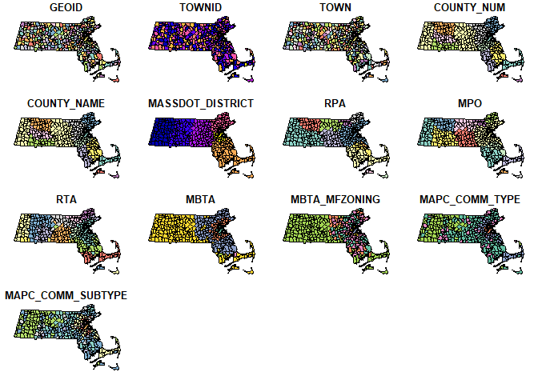

## Generating Municipal Lookups

This repo contains a set of lookups one can use to attach 2020 County
Subdivision GEOIDs to various municipality-based attributes. This work
was adapted from an internal CTPS spreadsheet, that was expanded in
Spring 2023. Much of the work was done using found datasets that
appeared to be useful or official.

The fields included are shown below:

