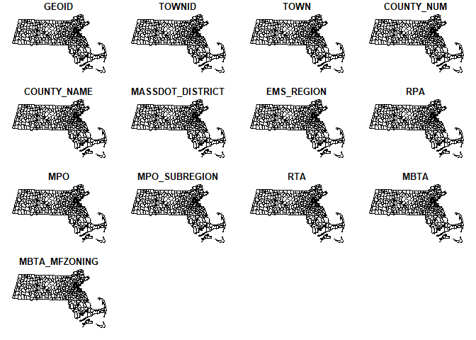

## Generating Municipal Lookups

This repo contains a set of lookups one can use to attach County
Subdivision GEOIDs to various municipality-based attributes. This work
was adapted from an internal CTPS spreadsheet, that was expanded in
Spring 2023. Much of the work was done using found datasets that
appeared to be useful or official. This list contains duplicate values
for towns where the GEOID changed. This is performed to facilitate
meshing with whichever 2020+ shapes you’re using. Take care that your
final dataset contains 351 munis!

Updated: March 2026: Updated four munis with new GEOIDS with 2024 ACS.
Added “GATEWAY_CITY” designation. Updated Boston MPO subregions for
Dedham and Sherborn. Updated RTAs. Subscript \_2026

Updated: June 2025: Added Manchester by the Sea to CATA; subscript:
\_2025. Note from Mar 2026, some RTAs were likely out of date in 2025. The updated on Mass.gov is Aug 2 2024 and they were not included here.

The fields included are shown below:

